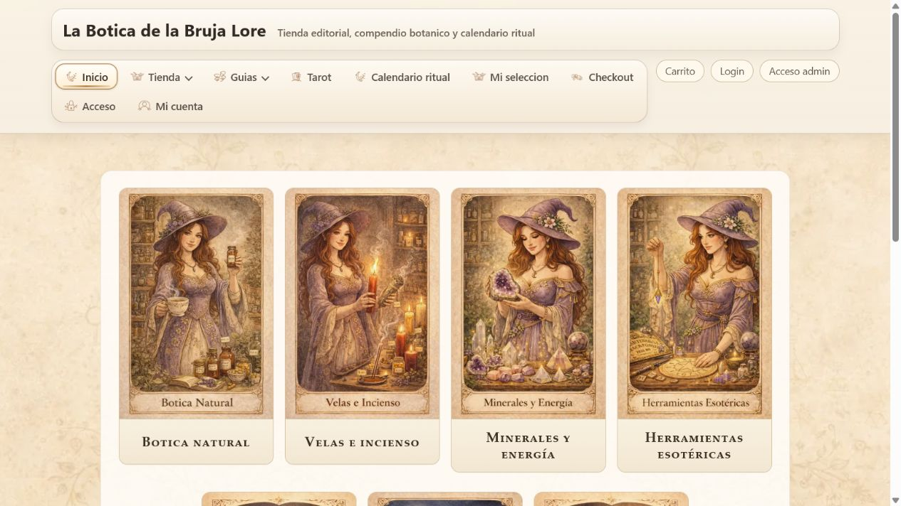

# Auditoría visual: La Botica de la Bruja Lore

Repositorio auditado: [carlos-arcas/botica_bruja_lore](https://github.com/carlos-arcas/botica_bruja_lore)

Fecha de revisión: 15 de julio de 2026.

## Lectura del proyecto

La Botica de la Bruja Lore no es solo una landing temática. Es un e-commerce editorial full-stack con Django y Next.js que integra catálogo, inventario, cesta, checkout, pedidos, cuenta de cliente, contenidos editoriales y backoffice.

El proyecto demuestra capacidad para construir un producto completo: experiencia pública, lógica comercial, persistencia, operaciones internas y recorridos posteriores a la compra.

## Fortalezas visuales

- Identidad reconocible desde el primer vistazo, con ilustración y lenguaje visual propios.
- Categorías comerciales diferenciadas mediante imágenes y composición editorial.
- Coherencia entre botica natural, rituales, tarot y contenidos de orientación.
- Buena continuidad visual entre navegación, superficies comerciales y páginas informativas.
- El producto evita el aspecto de plantilla tecnológica genérica.

## Fortalezas de producto

- Catálogo dividido por secciones y fichas de producto.
- Cesta, checkout, cálculo de envío y pago local simulado.
- Pedidos, documentos, seguimiento y cuenta de cliente.
- Inventario, movimientos, incidencias de stock y backoffice operativo.
- Guías, rituales, calendario y tarot como capa editorial diferenciadora.
- Arquitectura Django + Next.js con pruebas específicas por flujo.

## Mejoras visuales prioritarias

1. Compactar la navegación móvil. El menú expandido ocupa el primer viewport y retrasa el acceso a la propuesta principal.
2. Completar imágenes reales en catálogo y ficha. Los productos locales de validación muestran estados "Sin imagen" y grandes áreas vacías.
3. Sustituir el texto técnico del seed local por copy comercial representativo antes de usar capturas de catálogo en el portfolio.
4. Simplificar la cabecera de escritorio. "Mi selección" y "Carrito", además de "Acceso", "Login" y "Mi cuenta", compiten por atención.
5. Dividir visualmente el checkout en pasos o resumen lateral para reducir la sensación de formulario largo.

## Valor para el perfil profesional

Este proyecto acredita desarrollo web más allá de una web informativa. Permite presentar experiencia real en e-commerce, autenticación, gestión de pedidos, bases de datos, lógica de inventario y herramientas administrativas.

En el portfolio debe aparecer como servicio complementario a la automatización, pero como evidencia fuerte de que también se pueden construir productos web completos y mantenibles.

## Conclusión

La base visual y funcional es sólida y diferencial. La mejora con mayor retorno es conectar esa identidad de portada con un catálogo que utilice imágenes y textos comerciales reales, y asegurar que en móvil el contenido principal aparezca antes que el menú completo.
